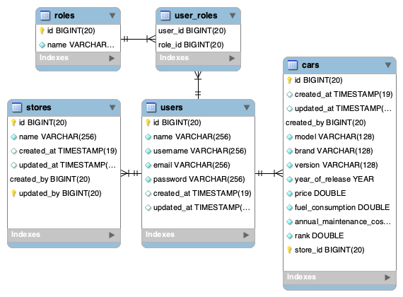
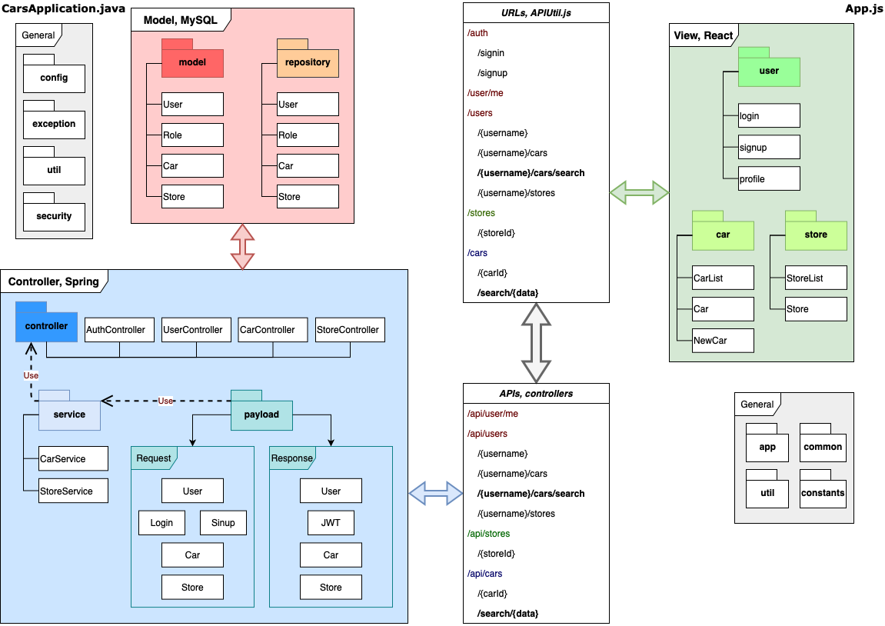

# Describe the architecture you will use and the motivation for its choice? (max 500 characters)

- [Model View Controller](https://en.wikipedia.org/wiki/Model–view–controller)
- [Laravel](https://laravel.com/docs/7.x/structure)

Database schema v0.0.1, for quick prototype.

Backend and frontend architectures. Get idea from Laravel (my favorite).

The architecture of backend contains two components, model and controller. The model has the function which directly construct, connect and communicate with database. The controller invokes data model and query syntax to respond the APIs requests that described in the controller package. Payload performs as the parser to get parameters from the url and prepare the responses. The service package is the central control place which implement the logics to fetch data and generate results.

Due to client server, ReactJS provides the UI, validates requests and sends to corresponding APIs. All the routes are defined in the `Route` tag, and the API map is in  `APIUtils.js` script.

# You have a team of 3 developers. How would you tackle working together on the stories?

_Keywords: scrum_

## Work on together

- functionalities (modules), 
- APIs (categories and members),
- database (schemas and tables), 
- UI (components), 
- schedules (stages deadlines), 
- resources (language, framework, template, conventions, etc). 

_Tools: team (skype, whatsup), trello, draw.io, workbench, excel, photo._

## Work on individual

Similar to the Github repository I created. One developer works on the server side; One developer focuses on the client side; One developer responses to full stack.

Not only the codes but the supporting materials are also important.
- Environment: library and package requirement, tool, ...
- Documentation: diagram, step, issue, tutorial, ...
- Convention

# Can you describe 1 thing that can go wrong with your code once in production?

Deployment (_Remote, direct to wrong ip_) vs Development (_Localhost), direct to `process.env.REACT_APP_API_BASE_URL || 'http://localhost:8080/api';`_).
- [process.env](https://codeburst.io/process-env-what-it-is-and-why-when-how-to-use-it-effectively-505d0b2831e7)

